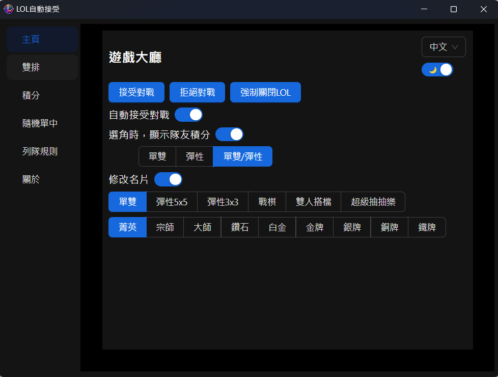

<h1>LOL自動接受輔助工具</h1>
  

  本程式可幫你自動接受英雄聯盟的對戰，還提供一些額外實用的功能

[English](./README_en.md) | 中文

## ✨ 功能
1. **🚀自動接受對戰**：1秒內會自動接受對戰  
   如果排到對戰且已經自動接受，可以反悔，只需要在程式介面中按下"拒絕對戰"
2. **🏆選角時顯示隊友積分**：如果所在伺服器已不顯示玩家名稱，功能失效
3. **👥顯示雙排玩家**：遊戲中，顯示雙方雙排(多排)玩家，會按照人數排序
4. **📖顯示列隊規則**：遊戲中，顯示雙方玩家列隊規則
5. **🎲隨機單中(ARAM)**：ARAM選角時，可先勾選隊友的英雄，如果英雄被骰出來，幫你自動選取
6. **🪪修改名片**：滑鼠放到自己的頭像上可看到效果

## 🌟 說明
- **超低CPU使用率**：使用訂閱事件的方式，只有特定事件發生時，程式才會運作，其他時候CPU使用率幾乎為0
- **不干預遊戲內檔案**：不會對遊戲檔案進行注入或修改，保持遊戲純淨
- **安全調用API**：使用與LeagueClient相同的API，安全性高

## 🖥 截圖

  
  

  
  

  
  

  

## 🔍 FAQ
### 1. 使用後會不會被封鎖帳號？
- 多位用戶使用超過三年，無任何帳號被鎖   
  本人不負任何責任，請自行評估使用風險  
  如有疑慮，請勿使用

### 2. 為什麼功能失效了？
- 功能完全依賴LeagueClient API，如果官方API更新，可能導致部分功能失效

### 3. 如何刪除程式？
- 把資料夾刪除即可，本程式不會在電腦其他地方生成檔案

### 4. 設定檔在哪裡？
- 一般情況不需要動到設定檔
- lol-app-win32-x64\resources\app\app-config.json

## 🎉 結尾
  **如果這個程式對您有幫助，請給個⭐️！**  
  **這是對我最大的鼓勵！**
