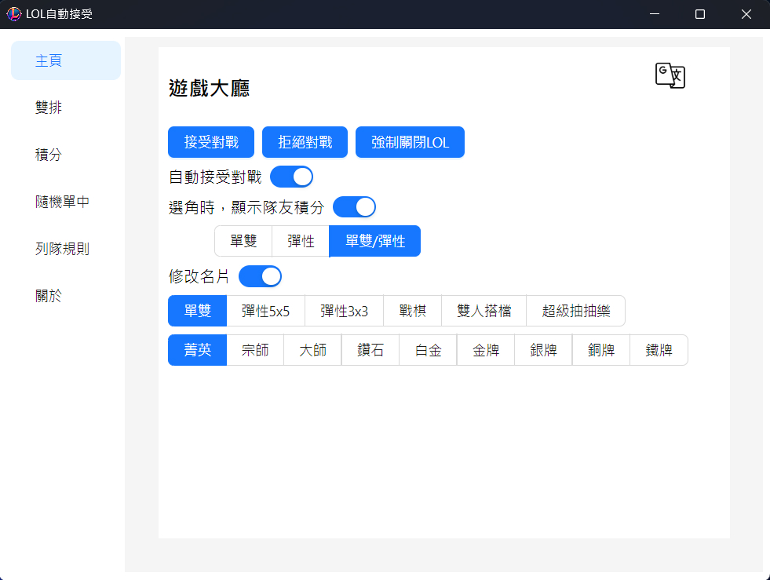
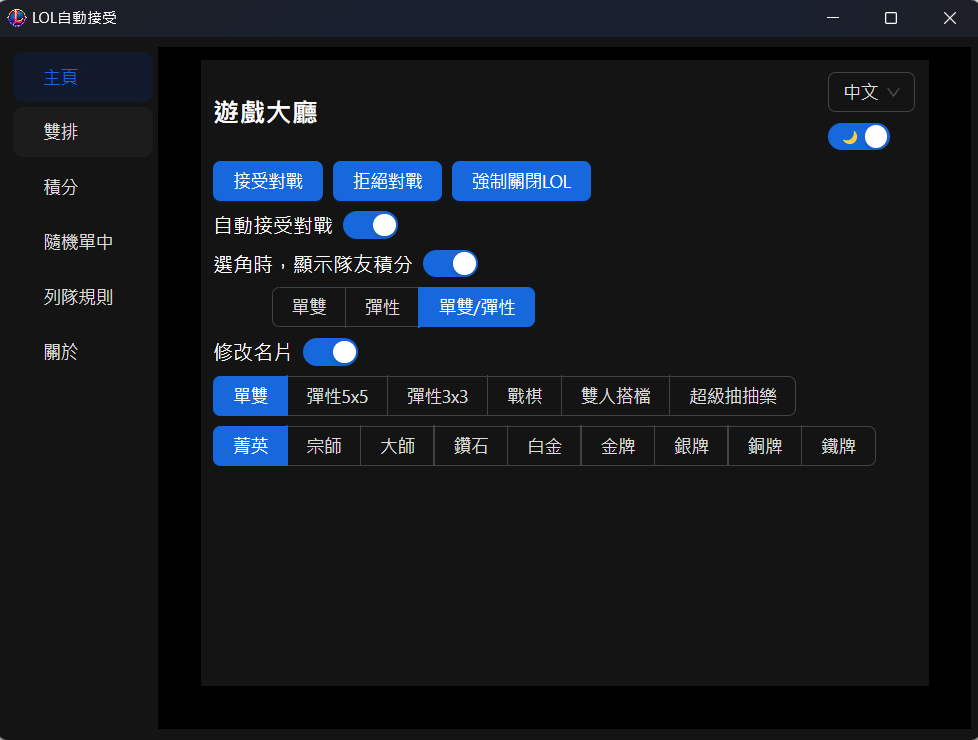
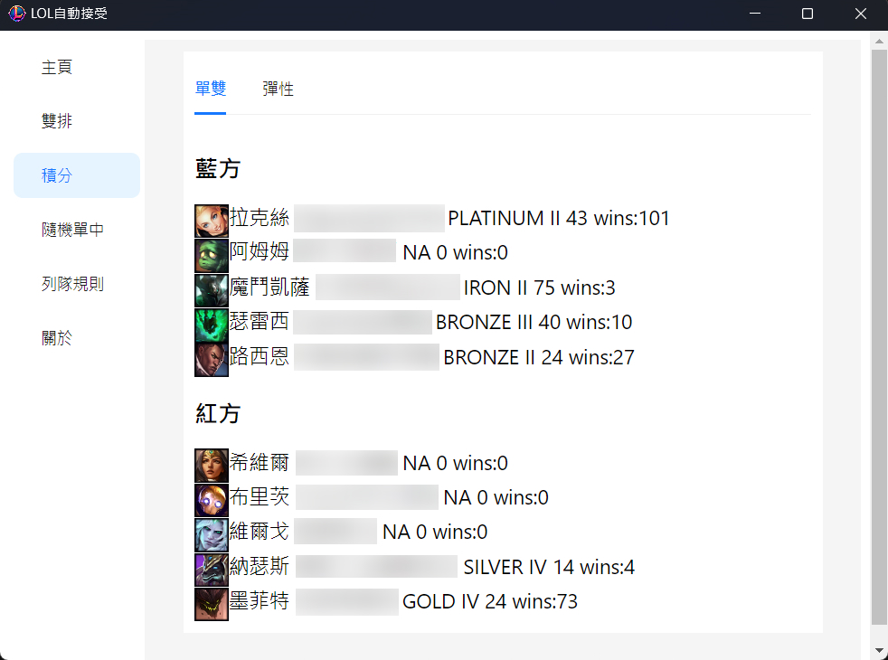
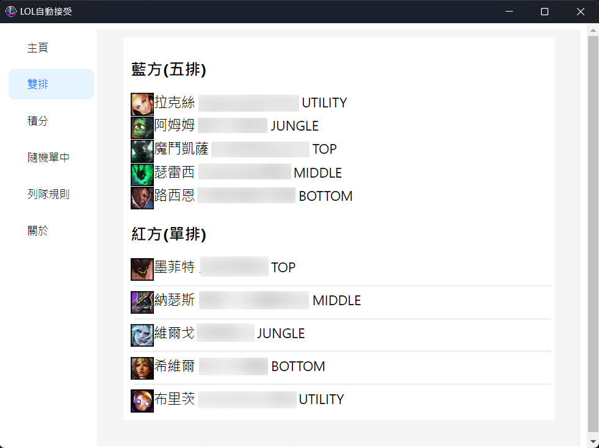
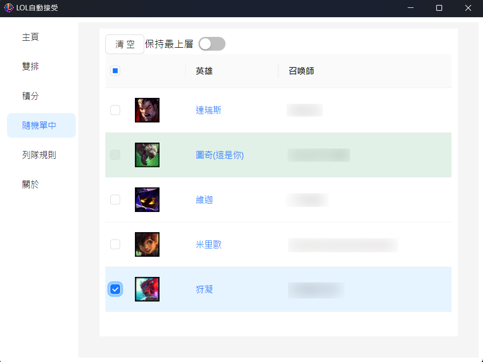
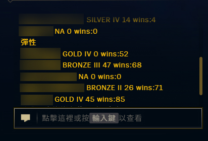

<h1>LOL Auto-Accept Assistant Tool</h1>
  

  This application automatically accepts League of Legends matches for you and provides several additional handy features.

English | [中文](./README.md)

## ✨ Features
1. **🚀 Auto-Accept Matches**: Automatically accepts matches within 1 second.  
   If a match is accepted and you change your mind, you can reject it from the application interface by clicking "Decline Match".
2. **🏆 Display Teammate Scores During Champion Selection**: This feature is inactive if the server no longer displays player names.
3. **👥 Display Duo Players**: In-game, shows duo (or multi) players on both sides, sorted by the number of players.
4. **📖 Display Selected Role**: In-game, shows the Selected Role for players on both sides.
5. **🎲 ARAM**: During ARAM champion selection, you can pre-select your teammates' champions. If one of these champions is rolled, the program will automatically select it for you.
6. **🪪 Modify Hovercard**: Hover over your avatar to see the effect.

## 🌟 Description
- **Ultra-Low CPU Usage**: Operates using event subscriptions, so the program only activates during specific events, resulting in near-zero CPU usage otherwise.
- **Non-Intrusive to Game Files**: Does not inject or alter game files, maintaining the game's integrity.
- **Safe API Usage**: Uses the same API as the LeagueClient, ensuring high security.

## 🖥 Screenshots

  
  

  
  

  
  

  

## 🔍 FAQ
### 1. Will using this result in a banned account?
- Numerous users have employed this tool for over three years without any account bans.  
  I assume no responsibility; please assess the risks yourself.  
  If in doubt, refrain from using it.

### 2. Why did a feature stop working?
- All functionalities are entirely dependent on the LeagueClient API. If the official API is updated, some features may become inactive.

### 3. How do I uninstall the program?
- Simply delete the folder. This program does not create files elsewhere on your computer.

### 4. Where is the configuration file?
- Under normal circumstances, there is no need to access the configuration file.
- lol-app-win32-x64\resources\app\app-config.json

## 🎉 Conclusion
**If you find this program helpful, please give it a ⭐️！**  
**Your support is the greatest encouragement for me！**